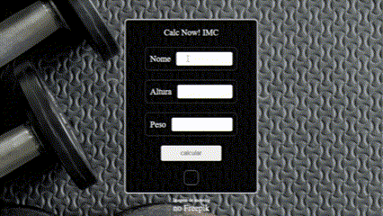

# BMI Calculator Documentation
###
## 🗽 English <--> [⛵️ Portuguese](../README.md)

## 🌮 Introduction

This document serves as a detailed documentation of the design of a Body Mass Index (BMI) Calculator, developed using HTML, CSS and JavaScript. The calculator allows users to calculate their BMI based on their height and weight, providing information about BMI classification and corresponding health status.

## 🫗 Project Description

The project consists of a web application that allows users to calculate their BMI quickly and easily. The interface is simple and intuitive, with fields for entering the user's name, height and weight, as well as a button to calculate BMI.



### 🥕 Main Features

- Calculates BMI based on height and weight entered by the user.
- Provides information about BMI classification and corresponding health status.
- Validation of fields to ensure that all necessary data is provided before calculation.

## 🥢 Implementation Details

This code is responsible for calculating the Body Mass Index (BMI) based on the height and weight values provided by the user in a web application. I will describe in detail what each part of the code does:

### 🥩 Selection of HTML elements:

```const btn_calcular = document.getElementById('calculate')```

   * This line selects the calculate button from the page with the ID 'calculate' and stores it in the variable btn_calcular.
---
### 🍧 BMI calculation function:

```function imc() { ... }```
* Defines a function called imc, which will be executed when the calculate button is clicked.

```const name = document.getElementById('name').value```
* Gets the value entered in the name input field on the page and stores it in the name variable.

```const height = document.getElementById('height').value```
* Gets the value entered in the height input field on the page and stores it in the height variable.

```const weight = document.getElementById('weight').value```
* Gets the value entered in the weight input field on the page and stores it in the weight variable.

```const result = document.getElementById('final-result')```
* Selects the HTML element where the BMI calculation result will be displayed and stores it in the result variable.
---

### 🍭 Conditions for calculating BMI and displaying the result:

1 - Check if all fields (name, height and weight) are filled in.
   * If any are empty, display a message requesting that all fields be filled in.

2 - Calculate BMI using the formula weight / (height * height).
   * Based on the calculated BMI value, it determines the BMI classification and displays a message corresponding to the health status. The ranks and statuses are:
       * BMI < 18.5: UNDER WEIGHT, INCREASE YOUR WEIGHT.
       * 18.5 <= BMI <= 24.9: NORMAL WEIGHT, HEALTHY WEIGHT. Keep it up.
       * 25.0 <= BMI <= 29.9: OVERWEIGHT, you are OVERWEIGHT.
       * 30.0 <= BMI <= 34.9: GRADE I OBESITY, MILD OBESITY, BE CAREFUL!
       * 35.0 <= BMI <= 39.9: GRADE II OBESITY (severe), MODERATE OBESITY, take care of yourself!
       * BMI >= 40.0: GRADE III OBESITY, SEVERE OBESITY, CONSULT A DOCTOR.
---
### 🍖 Event Listener:

```btn_calcular.addEventListener('click', imc)```
* Adds an event listener to the calculate button. When the button is clicked, the imc function is called to calculate and display the BMI result.
---